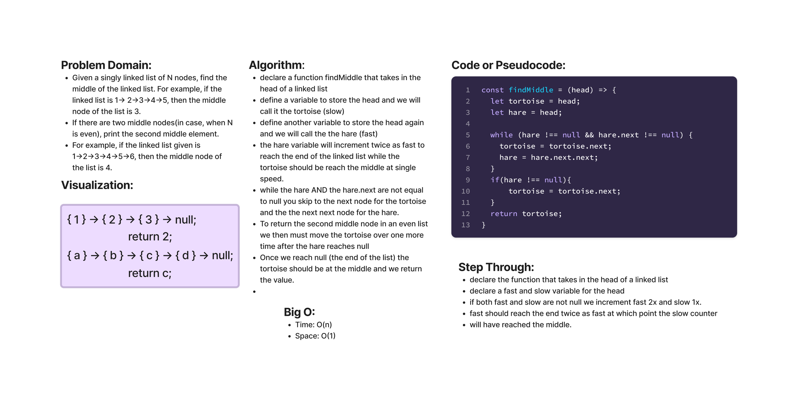

# Singly Linked List

* A linked list is a linear data structure, in which the elements are not stored at contiguous memory locations. The elements in a linked list are linked using pointers as shown in the below image:

### Challenge 38

* Given a singly linked list of N nodes, find the middle of the linked list. For example, if the linked list is `1-> 2->3->4->5`, then the middle node of the list is `3`.
* If there are two middle nodes(in case, when N is even), print the second middle element.
For example, if the linked list given is`1->2->3->4->5->6`, then the middle node of the list is `4`.

## Challenge

* Create a Node class that has properties for the value stored in the Node, and a pointer to the next Node. Within your LinkedList class, include a head property. Upon instantiation, an empty Linked List should be created. This object should be aware of a default empty value assigned to head when the linked list is instantiated. This value will be null for now.
* Define a method called insert which takes any value as an argument and adds a new node with that value to the head of the list with an O(1) Time performance.
* Define a method called includes which takes any value as an argument and returns a boolean result depending on whether that value exists as a Node’s value somewhere within the list.
* Define a method called toString which takes in no arguments and returns a string representing all the values in the Linked List, formatted as: "{ a } -> { b } -> { c } -> NULL"
* Define a method called append which takes any value as an argument and adds a new node with that value to the end of the list.
* Define a method called insertBefore which takes a value and a new value as arguments and adds a new node with the new value immediately before the first node that has the value specified.
* Define a method called insertAfter which takes a value and a new value as arguments and adds a new node with the new value immediately after the first node that has the value specified.
* Define a method called kthFromEnd which takes a number, k, as a parameter. Return the node’s value that is k from the end of the linked list.
* Define a method called zipLists which takes two linked lists as arguments. Zip the two linked lists together into one so that the nodes alternate between the two lists and return a reference to the head of the zipped list. Try and keep additional space down to O(1).

## Approach & Efficiency

* For this challenge I took a TDD approach. I started by writing the tests for the LinkedList class and then wrote the code to pass the tests. The Big O space/time for this approach is O(1) for space and O(n) for time.

## API

* `append()`
  * Arguments: value
  * Returns: nothing
  * Adds a new node with that value to the end of the list.
* `insert()`
  * Arguments: value
  * Returns: nothing
  * Adds a new node with that value to the head of the list with an O(1) Time performance.
* `includes()`
  * Arguments: value
  * Returns: Boolean
  * Indicates whether that value exists as a Node’s value somewhere within the list.
* `toString()`
  * Arguments: none
  * Returns: a string representing all the values in the Linked List, formatted as:
    * `"{ a } -> { b } -> { c } -> NULL"`
* `toArray()`
  * Arguments: none
  * Returns: an array of all the values in the Linked List, formatted as:
    * `[a, b, c]`
* `insertBefore()`
  * Arguments: value, new value
  * Returns: nothing
  * Adds a new node with the given new value immediately before the first node that has the value specified.
* `insertAfter()`
  * Arguments: value, new value
  * Returns: nothing
  * Adds a new node with the given new value immediately after the first node that has the value specified.
* `kthFromEnd()`
  * Arguments: k
  * Returns: the value of the node k from the end of the linked list
  * Returns an exception if k is greater than the length of the linked list
  * Returns an exception if k and the length of the list are the same
  * Returns an exception if k is not a positive integer
  * Returns an exception if the linked list is of a size 1
* `zipLists()`
  * Arguments: two linked lists
  * Returns: zipped linked list with nodes alternating between the two lists, formatted as:
    * list1 = `"{ a } -> { b } -> { c } -> NULL"`
    * list2 = `"{ d } -> { e } -> { f } -> NULL"`
    * zipLists(list1, list2) = `"{ a } -> { d } -> { b } -> { e } -> { c } -> { f } -> NULL"`
